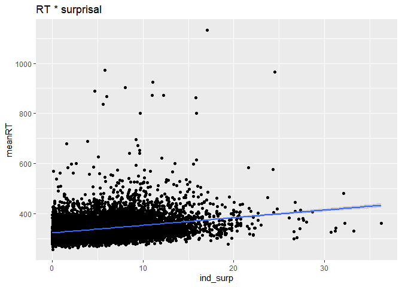
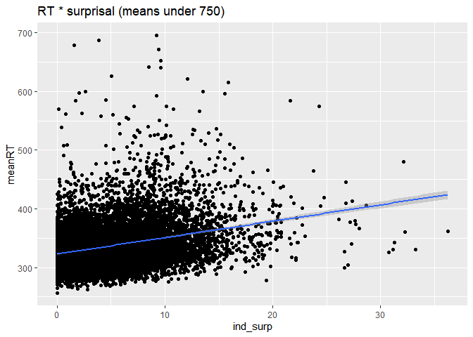

# Preliminaries

## Load packages

``` r
here::i_am("analysis/LL_analysis.Rmd")
library(here)
library(tidyverse) # for data processing
library(knitr)
library(lmerTest)
knitr::opts_chunk$set(echo = TRUE)
```

``` r
df_rnng <- read_tsv(here("analysis/data/ns-results.tsv"))
```

    ## Rows: 11680 Columns: 7
    ## -- Column specification --------------------------------------------------------
    ## Delimiter: "\t"
    ## chr (1): word
    ## dbl (6): item, sent, token_id, depth, ind, brn
    ## 
    ## i Use `spec()` to retrieve the full column specification for this data.
    ## i Specify the column types or set `show_col_types = FALSE` to quiet this message.

``` r
df_ids <- read_tsv(here("analysis/data/ids.tsv"))
```

    ## Rows: 11705 Columns: 6
    ## -- Column specification --------------------------------------------------------
    ## Delimiter: "\t"
    ## chr (1): Component
    ## dbl (5): Index, TreeInd, TreeWord, TokenItem, TokenZone
    ## 
    ## i Use `spec()` to retrieve the full column specification for this data.
    ## i Specify the column types or set `show_col_types = FALSE` to quiet this message.

``` r
df_rts <- read_tsv(here("data/processed_RTs.tsv"))
```

    ## Rows: 848767 Columns: 12
    ## -- Column specification --------------------------------------------------------
    ## Delimiter: "\t"
    ## chr  (2): WorkerId, word
    ## dbl (10): WorkTimeInSeconds, correct, item, zone, RT, nItem, meanItemRT, sdI...
    ## 
    ## i Use `spec()` to retrieve the full column specification for this data.
    ## i Specify the column types or set `show_col_types = FALSE` to quiet this message.

## Clean up data and join RNNG with IDs

``` r
df_rnng <- df_rnng %>% 
  rename(story = item,
         word_num = token_id,
         ind_surp = ind,
         brn_surp = brn)

df_ids <- df_ids %>% 
  rename(story = TokenItem,
         zone = TokenZone,
         word_num = TreeWord,
         sent = TreeInd,
         word = Component) 

# there are some missing from the RNNG surprisals - cutting those out

df_surp <- left_join(df_ids, df_rnng, by = c("sent", "word_num"), suffix = c("", ".duplicate")) %>%
     select(-ends_with(".duplicate")) %>% 
      mutate(zone = if_else(story == 1, zone + 1, zone)) 

df_missing_rnng <- filter(df_surp, is.na(ind_surp))
df_surp <- filter(df_surp, !is.na(ind_surp))
```

## Collapse rows from same zone, sum surprisals over zone

``` r
df_surp <- df_surp %>% 
  group_by(story, zone, sent) %>% 
  summarize(
    # add column showing words, word_nums, depths, indices that were combined
    word_nums = str_c(word_num, collapse = "; "),
    words = str_c(word, collapse = "_"),
    indices = str_c(Index, collapse = "; "),
    depths = str_c(depth, collapse = "; "),
    ind_surp = sum(ind_surp),
    brn_surp = sum(brn_surp),
    total_words = n()
  )
```

    ## `summarise()` has grouped output by 'story', 'zone'. You can override using the
    ## `.groups` argument.

``` r
df_surp_zone_count <- df_surp %>% 
  group_by(story) %>% 
  count()
```

## Pulling in RTs

Count the item/zone rows to see if it matches the surprisal dataframe.

``` r
df_rts <- rename(df_rts, story = item)


df_rt_count <- df_rts %>% 
  group_by(story, zone) %>% 
  count()

df_zone_count <- df_rt_count %>% 
  group_by(story) %>% 
  count()


# this is a join just to check for items with RTs but without surprisals

df_missing_surp <- left_join(df_rt_count, df_surp, by = c("story", "zone")) %>% 
  filter(is.na(indices))
```

create joined RT with surprisal dataframe and remove rows where there is
no surprisal

``` r
df_rtsurp <- left_join(df_rts, df_surp, by = c("story", "zone")) %>% 
  filter(!is.na(ind_surp)) %>% 
  arrange(story, zone)
```

count trials per story/zone

``` r
df_words <- df_rtsurp %>% 
  group_by(story, zone, word) %>% 
  count()
```

add a column with story/zone identifier

``` r
df_rtsurp <- df_rtsurp %>% 
  mutate(story_zone  = str_c(story, zone, sep = "_"))
```

summarize by story/zone means

``` r
df_zonemeans <- df_rtsurp %>% 
  group_by(story_zone, ind_surp) %>% 
  summarize(
    meanRT = mean(RT, na.rm = TRUE)
  )
```

    ## `summarise()` has grouped output by 'story_zone'. You can override using the
    ## `.groups` argument.

which ones are over 750ms mean?

``` r
df_highmeans <- df_zonemeans %>% 
  filter(meanRT > 750)
```

# plot

summarize by story/zone means

``` r
p_rtsurp <- ggplot(
 df_zonemeans,
  aes(y = meanRT, x = ind_surp)
) +
  geom_point(
    stat = "identity"
  ) +
  geom_smooth(method = lm, level = 0.99) +
  ggtitle("RT * surprisal")
p_rtsurp
```

    ## `geom_smooth()` using formula 'y ~ x'

<!-- -->

plot without means over 750 (mostly last word in story)

``` r
p_lower <- ggplot(
 filter(df_zonemeans, meanRT < 750),
  aes(y = meanRT, x = ind_surp)
) +
  geom_point(
    stat = "identity"
  ) +
  geom_smooth(method = lm, level = 0.99) +
  ggtitle("RT * surprisal (means under 750)")
p_lower
```

    ## `geom_smooth()` using formula 'y ~ x'

<!-- -->

# stats

``` r
m_1 <- lmer(log(RT) ~ ind_surp + (1|WorkerId), data = df_rtsurp)
summary(m_1)
```

    ## Linear mixed model fit by REML. t-tests use Satterthwaite's method [
    ## lmerModLmerTest]
    ## Formula: log(RT) ~ ind_surp + (1 | WorkerId)
    ##    Data: df_rtsurp
    ## 
    ## REML criterion at convergence: 343451.6
    ## 
    ## Scaled residuals: 
    ##     Min      1Q  Median      3Q     Max 
    ## -6.2211 -0.5901 -0.1484  0.3896  8.9627 
    ## 
    ## Random effects:
    ##  Groups   Name        Variance Std.Dev.
    ##  WorkerId (Intercept) 0.06082  0.2466  
    ##  Residual             0.08774  0.2962  
    ## Number of obs: 845632, groups:  WorkerId, 180
    ## 
    ## Fixed effects:
    ##              Estimate Std. Error        df t value Pr(>|t|)    
    ## (Intercept) 5.684e+00  1.841e-02 1.783e+02  308.70   <2e-16 ***
    ## ind_surp    6.815e-03  7.698e-05 8.455e+05   88.53   <2e-16 ***
    ## ---
    ## Signif. codes:  0 '***' 0.001 '**' 0.01 '*' 0.05 '.' 0.1 ' ' 1
    ## 
    ## Correlation of Fixed Effects:
    ##          (Intr)
    ## ind_surp -0.022
